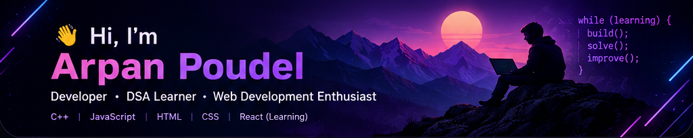

<div align="center">



<br>

# 👋 Hi, I'm Arpan Poudel

### 💻 C++ Learner • DSA Learner • Problem Solver

I'm currently focused on building a strong foundation in **C++ and Data Structures & Algorithms** through consistent problem solving.

<p>
  <a href="https://github.com/ArpanPoudell">
    
  </a>
  <a href="https://www.linkedin.com/in/arpan-poudel-3573172b2/">
    
  </a>
  <a href="https://leetcode.com/u/Arpan_Poudel/">
    
  </a>
</p>

</div>

---

## 👨‍💻 About Me

I'm currently learning **C++ and Data Structures & Algorithms** and improving my problem-solving skills by regularly solving programming problems.

* 🧠 Learning DSA with **C++**
* 🔥 Practicing problems on **LeetCode**
* 💡 Working on understanding algorithms rather than just memorizing solutions
* 🛠️ Maintaining a repository of my LeetCode solutions
* 📈 Trying to become better at problem solving every day
* 🌱 **Web Development is something I plan to explore next**

---

## 🧠 What I'm Currently Learning

<table>
<tr>

<td width="50%">

### 💻 C++

* C++ fundamentals
* STL
* Vectors
* Loops & conditionals
* Functions
* Basic algorithms

</td>

<td width="50%">

### 🧩 DSA

* Arrays
* Sorting
* Two Pointers
* Binary Search
* Sliding Window
* Hashing
* Basic problem-solving patterns

</td>

</tr>
</table>

---

## 📚 DSA Journey

| Topic          | Status        |
| :------------- | :------------ |
| Arrays         | 🟢 Practicing |
| Sorting        | 🟢 Practicing |
| Two Pointers   | 🟢 Practicing |
| Binary Search  | 🟢 Practicing |
| Sliding Window | 🟡 Learning   |
| Hashing        | 🟡 Learning   |
| Linked List    | ⚪ Not Started |
| Trees          | ⚪ Not Started |
| Graphs         | ⚪ Not Started |

> 🚀 **Building my DSA fundamentals one topic at a time.**

---

## 🔥 LeetCode Journey

<div align="center">

<a href="https://leetcode.com/u/Arpan_Poudel/">


</a>

<br><br>

<a href="https://leetcode.com/u/Arpan_Poudel/">

</a>

</div>

### 🎯 Current Goal

> **48 problems → 100 problems**

I'm focusing on understanding the patterns behind problems and improving my approach step by step.

---

## 🛠️ Current Skills

<div align="center">

### Languages


### Currently Exploring


</div>

---

## 📌 My Repositories

### 🧩 LeetCode

A collection of the LeetCode problems I'm solving while learning Data Structures & Algorithms.

**Language:** C++

Topics currently appearing in my practice include:

`Arrays` `Sorting` `Binary Search` `Two Pointers` `Sliding Window` `Hashing`

<a href="https://github.com/ArpanPoudell/LeetCode">

</a>

---

### 🛒 Ecom Service

One of my repositories for exploring and building projects.

<a href="https://github.com/ArpanPoudell/ecom-service">

</a>

---

## 🌱 What's Next

I don't want to pretend that I've already learned everything.

My learning path is:

```text
C++ Fundamentals
       ↓
DSA Fundamentals
       ↓
More Problem Solving
       ↓
Linked Lists
       ↓
Trees
       ↓
Graphs
       ↓
Web Development
       ↓
Full-Stack Development
```

> 🌱 **Learning one step at a time.**

---

## 🎯 Goals

### Current

* [x] Start consistent DSA practice
* [x] Start solving LeetCode problems
* [ ] Strengthen C++ fundamentals
* [ ] Reach 100 LeetCode problems
* [ ] Become comfortable with core DSA patterns

### Future

* [ ] Learn Linked Lists
* [ ] Learn Trees
* [ ] Learn Graphs
* [ ] Start Web Development
* [ ] Learn JavaScript
* [ ] Learn React
* [ ] Build more projects
* [ ] Explore Machine Learning

---

## 📈 My Progress

<div align="center">

```text
C++              ████████████████████  Learning
DSA              ████████████████░░░░  Learning
Problem Solving  ███████████████░░░░░  Improving
Web Development  ░░░░░░░░░░░░░░░░░░░░  Not Started
Machine Learning ░░░░░░░░░░░░░░░░░░░░  Future
```

</div>

---

## 💭 My Approach

> **Understand → Practice → Make Mistakes → Debug → Improve**

I'm not trying to learn everything at once.

I'm focusing on getting the fundamentals right first.

---

## 🤝 Let's Connect

<div align="center">

<a href="https://github.com/ArpanPoudell">

</a>

<a href="https://www.linkedin.com/in/arpan-poudel-3573172b2/">

</a>

<a href="https://leetcode.com/u/Arpan_Poudel/">

</a>

</div>

---

<div align="center">

### 🚀 Keep learning. Keep building. Keep improving.

⭐ Thanks for visiting my profile!

</div>
